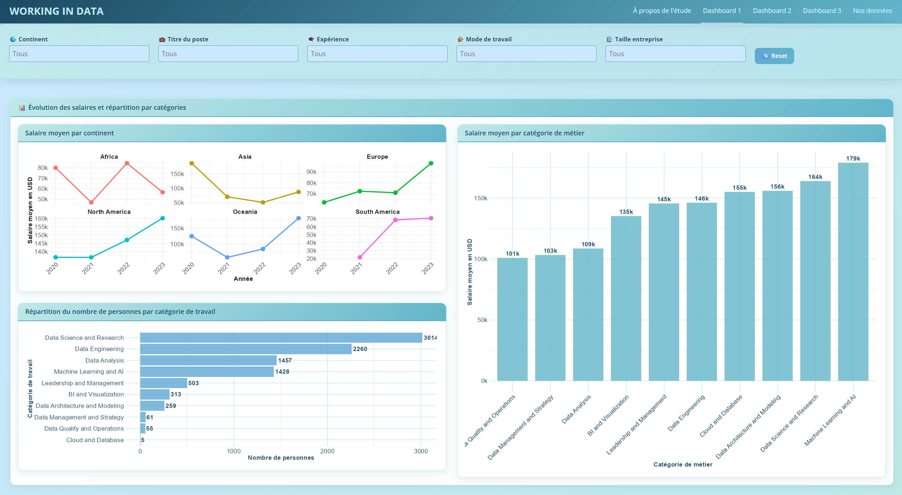
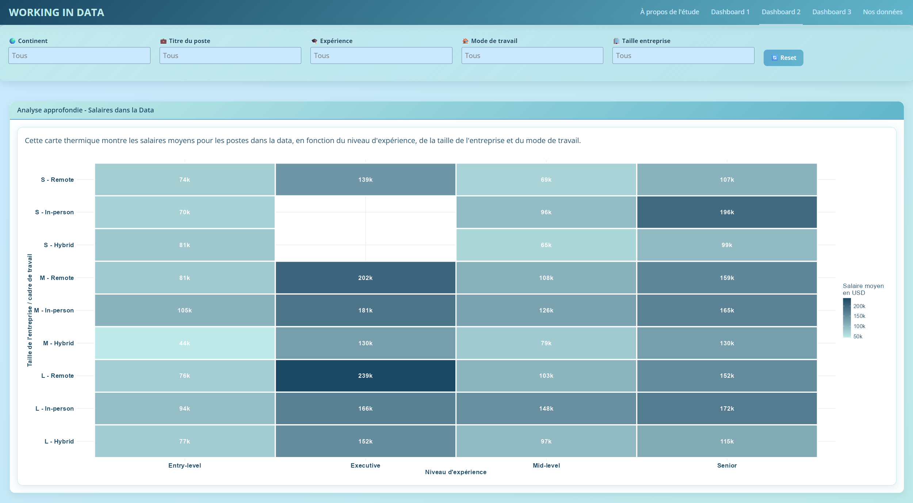
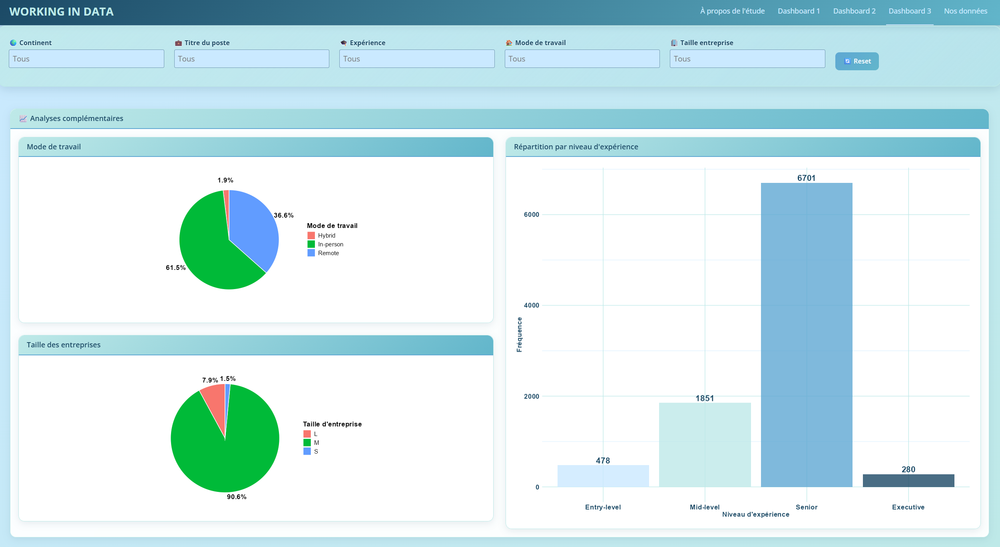

# 💼 Working in Data — Jobs in Data (R Shiny)

Application interactive développée avec **R Shiny** pour explorer les salaires et tendances du marché de l'emploi dans le domaine de la Data, à l'échelle mondiale.

---

## 📸 Aperçu

### Dashboard 1 — Évolution des salaires & répartition par catégories


### Dashboard 2 — Analyse approfondie des salaires


### Dashboard 3 — Analyses complémentaires


---

## 🚀 Fonctionnalités

- **Filtres globaux** : filtrage dynamique par continent, titre de poste, niveau d'expérience, mode de travail et taille d'entreprise, appliqués sur tous les dashboards simultanément
- **Dashboard 1** :
  - Évolution du salaire moyen par continent entre 2020 et 2023
  - Répartition du nombre de professionnels par catégorie de métier
  - Salaire moyen par catégorie de métier (Data Science, ML/AI, Data Engineering…)
- **Dashboard 2** :
  - Carte thermique croisant la taille d'entreprise, le mode de travail et le niveau d'expérience pour visualiser les salaires moyens
- **Dashboard 3** :
  - Répartition du mode de travail (Remote 61.5%, Hybrid 36.6%, In-person 1.9%)
  - Répartition par taille d'entreprise
  - Distribution des effectifs par niveau d'expérience (Entry-level, Mid-level, Senior, Executive)

---

## 📁 Structure du projet
```
├── app.R                  # Application R Shiny principale
├── jobs_in_data.csv       # Données source
├── assets/
│   ├── work1.png
│   ├── work2.png
│   └── work3.png
└── README.md
```

---

## ⚙️ Installation & lancement

### Prérequis

- R (>= 4.0)
- Les packages suivants :
```r
install.packages(c(
  "shiny", "shinydashboard", "ggplot2", "dplyr",
  "plotly", "tidyr", "scales"
))
```

### Lancer l'application
```r
shiny::runApp("app.R")
```

Ou depuis RStudio : ouvrir `app.R` et cliquer sur **Run App**.

---

## 📊 Données

Le dataset utilisé provient de [Jobs in Data](https://www.kaggle.com/datasets/hummaamqaasim/jobs-in-data), disponible sur Kaggle. Il recense des milliers d'offres et de salaires dans le secteur de la Data entre 2020 et 2023, avec les variables suivantes :

| Variable | Description |
|---|---|
| `job_title` | Titre du poste |
| `job_category` | Catégorie de métier |
| `salary_in_usd` | Salaire en USD |
| `experience_level` | Niveau d'expérience (Entry / Mid / Senior / Executive) |
| `work_setting` | Mode de travail (Remote / Hybrid / In-person) |
| `company_size` | Taille de l'entreprise (S / M / L) |
| `company_location` | Pays de l'entreprise |
| `work_year` | Année |

---

## 🔍 Insights clés

- 💰 Le **Machine Learning & AI** est la catégorie la mieux rémunérée (~179k USD en moyenne)
- 🌍 **L'Amérique du Nord** affiche les salaires les plus élevés, en forte croissance sur la période
- 🏠 Le travail **Remote** dans les grandes entreprises (L) au niveau **Executive** peut atteindre 239k USD
- 👔 Les profils **Senior** dominent largement le marché avec 6 701 individus sur 9 310

---

## 👤 Auteur

**Nathan Chan** — [GitHub](https://github.com/NathanChan1710)
